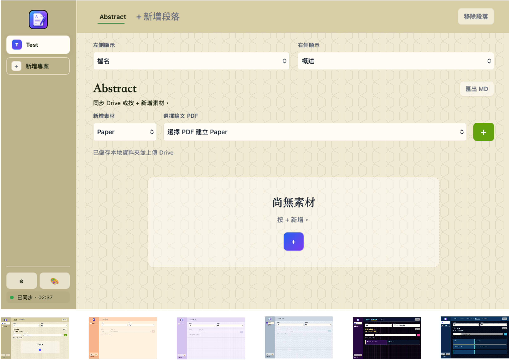

# Paper Composer

Paper Composer 是以 Google Drive 為主要同步對象的論文撰寫工具。每個專案都對應一個 Google Drive 資料夾，並放在工作區總資料夾下的一個專案子資料夾。使用時須建立 google drive api，並完成 google drive api 所要求的安全性設定、email 綁定等，在取得 ID、金鑰後輸入 Paper Composer 後可使用。



## 使用方式

1. 先在 Google Drive 設定中填入 OAuth Client ID、Client Secret 與本機工作區總資料夾。
2. 按 `新增專案`，填入專案名稱與對應的 Google Drive Folder ID；app 會在工作區中建立本地專案資料夾，並同步 Drive 內的 PDF / JSON。
3. 在上方新增段落，例如 Introduction、Related works、Method 或 Results。
4. 在 `選擇論文 PDF` 選取同步到本地的論文，按 `+` 新增為素材；也可以新增 Algorithm、Image、Table、Note 等文字素材。
5. 點擊素材卡片左右欄位可直接編輯內容；左側/右側顯示欄位可切換成檔名、簡稱、年份或各段落需要的內容欄位。
6. 編輯後按素材卡片上的 `儲存`，內容會寫入本地 `project.json`，並同步回 Google Drive；PDF 會保留在 Drive 與本地專案資料夾中。


## Data Model

- `user_data/drive_settings.json`: 本機 Google OAuth 設定與 token。
- `user_data/workspace_settings.json`: 只記錄工作區總資料夾。
- 不使用專案索引檔。app 啟動時掃描工作區總資料夾底下含 `project.json` 的子資料夾。
- 每個專案子資料夾:
  - `project.json`: 章節、素材、顯示欄位與編輯內容。
  - `*.pdf`: 從 Drive 同步下來或本地新增的 PDF。
  - `*.json`: 從 Drive 同步下來或本地新增的素材 JSON。
 
## Folder Structure

### Google Drive

```text
Google Drive
└── paper_project_folder/                 # 使用者自行建立，並將 Folder ID 填入 app
    ├── 01.pdf                            # 使用者自行放入，app 會同步到本地
    ├── 02.pdf                            # 使用者自行放入，app 會同步到本地
    ├── 03.pdf                            # 使用者自行放入，app 會同步到本地
    └── project.json                      # app 自動建立或同步，用來保存專案資料
```

### Local Workspace

```text
指定本機工作區路徑/
└── PaperComposerWorkspace/               # 使用者自行指定
    └── project_name_01/                  # app 依專案名稱自動建立
        ├── 01.pdf                        # app 從 Google Drive 自動同步
        ├── 02.pdf                        # app 從 Google Drive 自動同步
        ├── 03.pdf                        # app 從 Google Drive 自動同步
        └── project.json                  # app 自動建立或同步，用來保存專案資料
```

## Sync Rules

- 開啟 app 時會掃描工作區總資料夾，並自動同步所有專案。
- 新增專案時會在工作區總資料夾底下建立專案子資料夾，並同步 Drive 內的 PDF 與 JSON。
- 已存在於本地的 PDF 不會重複下載。
- JSON 會以 Drive 最新內容更新到本地。
- 儲存素材時會寫入本地 `project.json`，再把本地資料夾內的 PDF / JSON 上傳或更新到 Drive。

## Build / Install

### Windows

#### 1. 安裝 Rust

前往 [https://rustup.rs](https://rustup.rs)，下載並執行 `rustup-init.exe`，依照提示完成安裝。

安裝時若詢問 linker，請選擇預設選項（`msvc`）。這需要 Visual Studio C++ 編譯工具；如果尚未安裝，rustup 會顯示提示，可前往 [Visual Studio 下載頁](https://visualstudio.microsoft.com/visual-cpp-build-tools/) 安裝 **Build Tools for Visual Studio**，勾選 `Desktop development with C++`。

安裝完成後開啟新的 PowerShell 視窗，確認版本：

```powershell
rustc --version
```

需要 `1.86.0` 以上，本專案以 `1.95.0` 測試。

日後更新 Rust：

```powershell
rustup update stable
rustup default stable
```

#### 2. WebView2 Runtime

Windows 10/11 通常已內建 Microsoft Edge WebView2 Runtime，不需額外安裝。若 build 後啟動 app 時出現 WebView2 相關錯誤，請至 [Microsoft 官方頁面](https://developer.microsoft.com/microsoft-edge/webview2/) 下載安裝。

#### 3. 建置與封裝

在 PowerShell 執行：

```powershell
.\scripts\package_windows.ps1
```

輸出：

```text
.\dist\windows\Paper Composer\Paper Composer.exe
.\dist\windows\PaperComposer-windows.zip
```

為目前 Windows 使用者安裝捷徑：

```powershell
powershell -ExecutionPolicy Bypass -File ".\dist\windows\Paper Composer\install.ps1"
```

Windows app 使用 WebView2 作為原生視窗，啟動時自動開啟 `drive_bridge.exe`，關閉視窗時自動停止 bridge。

---

### macOS

#### 1. 安裝 Rust

在 Terminal 執行：

```bash
curl --proto '=https' --tlsv1.2 -sSf https://sh.rustup.rs | sh
```

依照提示完成後，重新開啟 Terminal 或執行：

```bash
source "$HOME/.cargo/env"
```

確認版本：

```bash
rustc --version
```

需要 `1.86.0` 以上，本專案以 `1.95.0` 測試。

日後更新 Rust：

```bash
rustup update stable
rustup default stable
```

#### 2. Xcode Command Line Tools

app shell 以 `swiftc` 編譯，需要 Xcode Command Line Tools：

```bash
xcode-select --install
```

#### 3. 建置

```bash
./scripts/build_macos_app.sh
```

輸出：

```text
./Paper Composer.app
./dist/Paper Composer.app
```

## Google Drive API 設定

Paper Composer 需要 Google Drive API 來同步每個專案資料夾中的 PDF、JSON 與 `project.json`。第一次使用前，請先在 Google Cloud 建立 OAuth 憑證，並在 app 內填入設定。

需要準備的值:

```text
Google OAuth Client ID
Google OAuth Client Secret
Google Drive Folder ID
工作區總資料夾路徑
```

### 1. 建立或選擇 Google Cloud 專案

進入 [Google Cloud Console](https://console.cloud.google.com/)，建立新專案，或選擇既有專案。

### 2. 啟用 Google Drive API

進入:

```text
APIs & Services > Library
```

搜尋 `Google Drive API`，點進去後按 `Enable`。

### 3. 設定 OAuth Consent Screen

進入:

```text
APIs & Services > OAuth consent screen
```

開發測試時可維持 `Testing`。基本欄位填:

```text
App name: Paper Composer
User support email: 你的 Gmail
Developer contact information: 你的 Gmail
```

測試階段請在 `Test users` 加入自己的 Gmail。

### 4. 建立 OAuth Client

進入:

```text
APIs & Services > Credentials > Create Credentials > OAuth client ID
```

應用程式類型選:

```text
網頁應用程式
```

建立後取得:

```text
Client ID
Client Secret
```

### 5. 在 Paper Composer 填入設定

開啟 app 後進入 Google Drive 設定，填入:

```text
Client ID
Client Secret
工作區總資料夾
```

`工作區總資料夾` 是本機用來存放所有專案資料夾的位置，例如:

```text
/Users/你的帳號/Documents/PaperComposerProjects
```

設定完成後，app 會開啟瀏覽器進行 Google OAuth 授權。授權成功後，token 會儲存在本機 `user_data/drive_settings.json`。

### 6. 取得 Google Drive Folder ID

每個 Paper Composer 專案會對應一個 Google Drive 資料夾。打開要同步的 Drive 資料夾，網址通常像:

```text
https://drive.google.com/drive/folders/1AbCDefGhijkLmNoPqRsTuvWxYz
```

`/folders/` 後面的字串就是 Folder ID:

```text
1AbCDefGhijkLmNoPqRsTuvWxYz
```

在 app 內新增專案時，將這個 Folder ID 貼到 `Google Drive Folder ID`。

### 注意事項

- `Client Secret` 與 `user_data/drive_settings.json` 不要提交到 GitHub。
- 本專案的 `.gitignore` 已忽略 `user_data`，避免本機 token 被提交。
- 如果 OAuth 失敗，請確認 OAuth Client 類型是 `Desktop app`，且自己的 Gmail 已加入 Test users。
